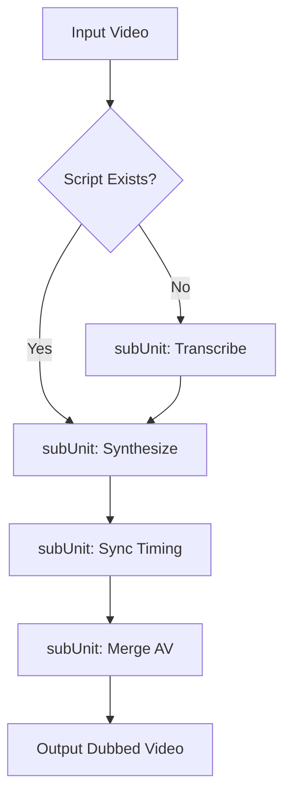

**CF2 Unit-Dubbing — Engineering Project Plan**

---

## 1. Executive Summary

This document outlines the implementation plan for **Unit-Dubbing**, a new CF2 pipeline unit that replaces the audio track of an existing video with cloned or synthesized speech. The unit is designed as a lightweight, non-invasive addition that reuses existing CF2 services (XTTS, FFmpeg, AudioService) and strictly follows CF2 architectural rules (single responsibility, smart skip, no hardcoding).

**Target use case:** Take an existing local video (e.g., `/home/matin/Desktop/_Classes_Objects.mp4`), strip its original audio, generate cloned narration via Coqui XTTS v2, and produce a final redubbed video without touching the visual track.

---

## 2. Objectives & Success Criteria

| Objective | Success Metric |
|---|---|
| Reuse existing CF2 services | Zero modification to `xtts_service.py`, `AudioService`, or `FFmpegService` |
| Follow CF2 unit conventions | Compliant with R4, R6, R14, R17, R19, R24 |
| Support cloned voice workflow | Accept speaker WAV + script → output dubbed MP4 |
| Support manual script injection | Skip transcription if `script_path` is provided |
| Smart execution | Skip any subUnit whose output artifact already exists |

---

## 3. Scope

### In Scope
- Audio replacement for existing MP4 files
- Whisper-based transcription (optional, skippable)
- XTTS v2 voice cloning synthesis
- Edge-TTS fallback synthesis
- Audio duration sync via `atempo`
- Final merge (video + new audio)
- Optional background music mixing (`keep_bgm`)

### Out of Scope
- Visual modification or rendering
- Lip-sync / viseme generation
- Real-time dubbing
- Multi-speaker diarization (Phase 1)
- Translation pipeline (future Phase 2 enabler)

---

## 4. Architecture Overview

### 4.1 Unit Structure

```
Unit-Dubbing (unit_dubbing.py)
├── subUnitTranscribe   → Generate script.txt via Whisper (optional)
├── subUnitSynthesize   → Generate dubbed.mp3 via XTTS/Edge
├── subUnitSync         → Stretch/compress dubbed.mp3 to match video duration
└── subUnitMerge        → Strip original audio + mux → dubbed_final.mp4
```

### 4.2 Data Flow

```
input: source_video + speaker_wav + script (optional)
        ↓
[subUnitTranscribe]  ──► output/{slug}/dubbing/script.txt
        ↓
[subUnitSynthesize]  ──► output/{slug}/dubbing/dubbed.mp3
        ↓
[subUnitSync]        ──► output/{slug}/dubbing/dubbed_synced.mp3
        ↓
[subUnitMerge]       ──► output/{slug}/dubbing/dubbed_final.mp4
```

---

## 5. Workspace & Artifact Specification

### 5.1 Directory Layout
```
output/{TopicSlug}/
  dubbing/
    .lock                       # Execution lock file
    script.txt                  # Transcribed or provided script
    script_chunks/              # Per-sentence audio chunks (long-form)
      ├── 000.mp3
      └── 001.mp3
    dubbed.mp3                  # Raw synthesized audio
    dubbed_synced.mp3           # Duration-corrected audio
    dubbed_final.mp4            # Final deliverable
```

### 5.2 Artifact Skip Rules (Smart Skip)

| Artifact Exists | Behavior |
|---|---|
| `script.txt` | Skip `subUnitTranscribe` |
| `dubbed.mp3` | Skip `subUnitSynthesize` |
| `dubbed_synced.mp3` | Skip `subUnitSync` |
| `dubbed_final.mp4` | Skip entire `Unit-Dubbing` |

---

## 6. Configuration Schema

Add to `data.json`:

```json
{
  "Unit-Dubbing": true,
  "dubbing_config": {
    "source_video": "/home/matin/Desktop/_Classes_Objects.mp4",
    "script_path": "",
    "tts_engine": "xtts",
    "sync_mode": "atempo",
    "keep_bgm": false,
    "bgm_volume": 0.15,
    "voice_clone_config": {
      "speaker_wav": "assets/voices/matin.wav",
      "language": "en",
      "device": "cpu",
      "use_cache": true
    }
  }
}
```

### Configuration Logic
- **`script_path`**: If non-empty, Whisper is bypassed entirely.
- **`tts_engine`**: `"xtts"` triggers voice cloning; `"edge"` triggers fast cloud TTS fallback.
- **`sync_mode`**: `"atempo"` uses existing `AudioService.apply_atempo()`.
- **`keep_bgm`**: If `true`, original audio is not stripped but mixed under new narration at `bgm_volume`.

---

## 7. Service & Tool Mapping

### 7.1 Existing Services (Zero Changes)

| Service | Function | Used By |
|---|---|---|
| `xtts_service.py` | `synthesize_xtts(text, speaker_wav, output_wav)` | subUnitSynthesize |
| `AudioService` | `apply_atempo(input, output, ratio)` | subUnitSync |
| `AudioService` | `merge_audio_video(video, audio, output)` | subUnitMerge |
| `FFmpegService` | `mix_bgm(video, voice, bgm, output, vol)` | subUnitMerge (optional) |
| `TTSService` | `split_sentences(text)` | subUnitSynthesize (chunking) |
| `TTSService` | `generate_edge(text, voice, output)` | subUnitSynthesize (fallback) |

### 7.2 New Components

| File | Responsibility | Est. Lines |
|---|---|---|
| `unit_dubbing.py` | Orchestrator router; enforces skip logic | ~120 |
| `tools/dubbing_transcribe.py` | Whisper wrapper: video → script.txt | ~40 |
| `tools/dubbing_synthesize.py` | Thin adapter: script → dubbed.mp3 | ~50 |
| `tools/dubbing_merge.py` | Thin adapter: sync + merge orchestration | ~40 |

**Total new code: ~250 lines.**

---

## 8. Implementation Phases

### Phase 1: Core Pipeline (Week 1)
1. Scaffold `unit_dubbing.py` with CF2-compliant router
2. Implement `subUnitMerge` (simplest; strip + replace audio)
3. Implement `subUnitSynthesize` (integrate existing XTTS)
4. Implement `subUnitSync` (wrap `apply_atempo`)
5. Local test with provided `_Classes_Objects.mp4`

### Phase 2: Transcription & Robustness (Week 1–2)
1. Implement `subUnitTranscribe` via `openai-whisper`
2. Add sentence chunking for long scripts (>5 min)
3. Implement smart skip validation (checksum or file-size based)
4. Add `.lock` file handling to prevent concurrent runs

### Phase 3: Integration & Polish (Week 2)
1. Add `dubbing_config` validation schema
2. Implement Edge-TTS fallback path
3. Add optional `keep_bgm` mixing
4. Write unit tests for skip logic
5. Update CF2 master router to register `Unit-Dubbing`

---

## 9. Runtime Decision Tree

```
START Unit-Dubbing
│
├─► source_video exists? ──► NO → raise FileNotFoundError
│
├─► dubbed_final.mp4 exists? ──► YES → EXIT (skip entire unit)
│
├─► script_path provided? ──► YES → use provided script
│   └─► NO → run subUnitTranscribe (Whisper) → script.txt
│
├─► dubbed.mp3 exists? ──► YES → skip synthesize
│   └─► NO → run subUnitSynthesize
│       ├─► tts_engine == "xtts" → synthesize_xtts()
│       └─► tts_engine == "edge" → generate_edge()
│
├─► dubbed_synced.mp3 exists? ──► YES → skip sync
│   └─► NO → run subUnitSync (apply_atempo to match video duration)
│
└─► run subUnitMerge
    ├─► keep_bgm == false → strip + merge
    └─► keep_bgm == true → mix original audio under new voice
```

---

## 10. Risk Assessment & Mitigation

| Risk | Impact | Mitigation |
|---|---|---|
| XTTS inference too slow on CPU | High | Add Edge-TTS fallback; add sentence chunking; document GPU recommendation |
| Audio duration mismatch after atempo | Medium | Log ratio used; flag if `ratio > 1.5` or `< 0.7` for manual review |
| Whisper hallucination on code terms | Medium | Allow manual `script_path` override; skip transcription entirely for technical content |
| Concurrent runs corrupt output | Low | Use `.lock` file in `dubbing/` workspace |
| Large video memory usage | Medium | Chunk script at sentence level; process audio in segments |

---

## 11. Deliverables

| Deliverable | Location | Phase |
|---|---|---|
| Unit orchestrator | `src/cf2/core/units/unit_dubbing.py` | 1 |
| Transcription tool | `src/cf2/tools/dubbing_transcribe.py` | 2 |
| Synthesis tool | `src/cf2/tools/dubbing_synthesize.py` | 1 |
| Merge tool | `src/cf2/tools/dubbing_merge.py` | 1 |
| Config schema update | `src/cf2/config/schemas/dubbing_schema.json` | 3 |
| Integration test | `tests/units/test_unit_dubbing.py` | 3 |
| Usage documentation | `docs/unit_dubbing.md` | 3 |

---

## 12. Acceptance Criteria

- [ ] `Unit-Dubbing` executes end-to-end on `_Classes_Objects.mp4` with provided script
- [ ] `dubbed_final.mp4` contains original video + cloned voice audio
- [ ] Re-running the unit with existing artifacts completes in <2 seconds (smart skip)
- [ ] No modifications required to `Unit-Data`, `Unit-Debate`, or rendering pipeline
- [ ] All new functions are 50–80 lines maximum (CF2 R17)
- [ ] All paths are config-driven; zero hardcoded strings (CF2 R19)

---

## 13. Next Steps

1. **Approve** this plan and confirm XTTS vs. Edge preference for MVP
2. **Provide** sample `speaker_wav` path and test video for validation
3. **Assign** Phase 1 implementation (estimated 1 developer × 3 days)
4. **Schedule** integration review before Phase 3 polish begins

---

**Document Version:** 1.0  
**Target CF2 Release:** v0.4.0  
**Estimated Effort:** 1 developer × 1.5 weeks


Here is the formal Project Plan Document for **Unit-Dubbing**.

---

# 📄 Project Plan: CF2 Unit-Dubbing Integration

| **Project** | Unit-Dubbing (Audio Replacement Service) |
| :--- | :--- |
| **Status** | 🟢 Proposed / Ready for Dev |
| **Owner** | Core-CF2 Team |
| **Priority** | High (Enables Content Refresh & Avatar Features) |
| **Est. Effort** | ~4-6 Hours (mostly wiring existing services) |

---

## 1. Executive Summary
Implement a modular **Unit-Dubbing** service within the CF2 architecture. This unit will take an existing video file, strip its audio, generate a new narration using a cloned voice (XTTS), sync the timing, and merge it back into the video.

**Primary Use Cases**:
*   Refreshing old tutorials with new narration.
*   Translating video content (EN → BN) by swapping audio.
*   Powering the "Hologram Teacher" avatar feature.

---

## 2. Scope & Boundaries

| ✅ In Scope | ❌ Out of Scope |
| :--- | :--- |
| Audio Transcription (Whisper) | Lip-syncing (visual mouth movement) |
| Voice Cloning (XTTS v2) | Video editing/cutting |
| Audio Time-stretching (Atempo) | Background music mixing (v2 feature) |
| FFmpeg Merging | Real-time streaming |

---

## 3. High-Level Architecture

The unit follows a linear 4-step pipeline. It is designed to be **stateless** and **idempotent** (re-running doesn't break things).



### The 4 Sub-Units

| ID | Name | Logic | Service Used |
| :--- | :--- | :--- | :--- |
| **SU-01** | `Transcribe` | Video → Text (`script.txt`) | `Whisper` (New) |
| **SU-02** | `Synthesize` | Text → Audio (`dubbed.mp3`) | `XTTS` (Existing) |
| **SU-03** | `Sync` | Stretch/Squash audio to match video length | `AudioService` (Existing) |
| **SU-04** | `Merge` | Silent Video + New Audio → Final MP4 | `FFmpeg` (Existing) |

---

## 4. Directory & File Structure

### A. Source Code (`src/cf2/`)
```text
core/
├── services/
│   ├── xtts_service.py        # EXISTING (Reused)
│   ├── audio_service.py       # EXISTING (Reused for atempo)
│   └── whisper_service.py      # 🆕 NEW (Thin wrapper for Whisper)
├── units/
│   └── unit_dubbing.py         # 🆕 NEW (Main Orchestrator)
└── utils/
    └── file_lock.py            # EXISTING (Reused for .lock files)
```

### B. Workspace Output (`output/{topic_slug}/dubbing/`)
```text
dubbing/
├── .lock                       # Prevents parallel execution
├── config.json                 # Snapshot of config used
├── script.txt                  # From Whisper or input
├── dubbed_raw.mp3              # From XTTS
├── dubbed_synced.mp3           # After Atempo
└── final.mp4                   # Final Video
```

---

## 5. Configuration Schema

Located in `data/profiles/{profile_name}.json`.

```json
"Unit-Dubbing": {
    "active": true,
    "input_video_path": "/home/matin/Desktop/_Classes_Objects.mp4",
    "manual_script_path": "",  // If empty, use Whisper
    "output_dir": "output/science/dubbing",

    "tts_config": {
        "engine": "xtts",      // "xtts" or "edge"
        "speaker_wav": "assets/voices/matin.wav",
        "language": "en"
    },

    "sync_config": {
        "mode": "atempo",      // "atempo" or "pad_silence"
        "stretch_factor": 1.0  // Auto-calculated
    },

    "video_config": {
        "strip_original_audio": true,
        "codec": "libx264",
        "preset": "fast"
    }
}
```

---

## 6. Implementation Phases

| Phase | Task | File | Lines | Status |
| :--- | :--- | :--- | :--- | :--- |
| **P1** | Create `WhisperService` wrapper | `services/whisper_service.py` | ~30 | 🆕 |
| **P1** | Create `unit_dubbing.py` orchestrator | `units/unit_dubbing.py` | ~120 | 🆕 |
| **P2** | Implement Smart Skip Logic (R14) | `units/unit_dubbing.py` | ~20 | 🔄 |
| **P2** | Integrate `AudioService.atempo` | `units/unit_dubbing.py` | ~10 | 🔄 |
| **P3** | Create CLI Test Script | `test_dubbing.py` | ~50 | 🆕 |

---

## 7. Compliance & Rules (CF2 Architecture)

This design strictly adheres to CF2 Rules.

| Rule | Compliance Strategy |
| :--- | :--- |
| **R4** (Single Resp) | Unit *only* does audio swapping. Never touches visuals or data generation. |
| **R6** (No Data Pollution) | Writes **only** to `output/{topic}/dubbing/`. Never modifies source video. |
| **R14** (Smart Skip) | Checks for `final.mp4` → `dubbed_synced.mp3` → `script.txt` before running subs. |
| **R17** (Function Size) | `run_sub_unit()` is < 20 lines. Logic is delegated to Services. |
| **R19** (No Hardcoding) | All paths, voices, and settings come from `profile.json`. |
| **R24** (Atomic) | Uses `.lock` file. If crash happens, re-run resumes from last file. |

---

## 8. Logic Flow: The "Smart Skip" Decision Tree

This is the runtime logic inside `unit_dubbing.py`.

| Step | Check | Action |
| :--- | :--- | :--- |
| **0** | Does `dubbing/final.mp4` exist? | 🛑 **STOP**. Unit is done. |
| **1** | Is `manual_script_path` provided? | ✅ Skip Transcribe. ❌ Run Transcribe. |
| **2** | Does `dubbing/script.txt` exist? | ✅ Skip Transcribe. ❌ Run Transcribe. |
| **3** | Does `dubbing/dubbed_raw.mp3` exist? | ✅ Skip Synthesize. ❌ Run XTTS. |
| **4** | Calculate Video Dur vs Audio Dur | If mismatch > 0.5s → Run Sync (Atempo). |
| **5** | Does `dubbing/final.mp4` exist? | ✅ Skip Merge. ❌ Run FFmpeg Merge. |

---

## 9. Risks & Mitigation

| Risk | Impact | Mitigation |
| :--- | :--- | :--- |
| **Whisper Hallucination** | Bad script → Bad audio | Allow `manual_script_path` in config to override. |
| **XTTS Slow** | Long video takes hours | Implement `TTSService.split_sentences()` (chunking) in v1.1. |
| **Audio Desync** | Lip movement vs audio mismatch | `atempo` fixes duration, but not sentence timing. Acceptable for v1. |
| **GPU OOM** | XTTS crashes on 4GB VRAM | Add `device: "cpu"` fallback in config. |

---

## 10. Deliverables Checklist

- [ ] `src/cf2/core/services/whisper_service.py`
- [ ] `src/cf2/core/units/unit_dubbing.py`
- [ ] `test_dubbing.py` (Runnable demo script)
- [ ] Update `data/profiles/default.json` with dummy config
- [ ] Documentation in `README.md` (How to run a dub)
